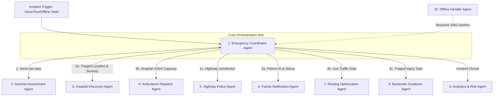

# MULTI-AGENT AI SYSTEM: ROADGUARDIAN AI

## Enterprise-Grade 10-Agent Orchestration Network

---

## 1. AGENT COMMUNICATION DIAGRAM

---

## 2. THE 10-AGENT MANIFESTO

### 1. Emergency Coordinator Agent (The Orchestrator)

- **Responsibilities:** Acts as the central router and state machine. Validates inputs, triggers specialized agents concurrently, aggregates their outputs, and publishes the final dispatch mandate.
- **Inputs:** Raw unstructured reports, Offline SMS Hashes.
- **Outputs:** Verified `IncidentPayload`, Dispatch Commands.
- **Tools:** `trigger_agent()`, `broadcast_websocket_event()`, `escalate_to_human()`
- **Prompt Signature:** _"You are the Chief Coordinator. A high-stress incident has been reported. Parse the raw input, request a Severity Assessment, and upon receiving it, immediately trigger Hospital, Ambulance, and Police agents concurrently. Do not delay."_

### 2. Severity Assessment Agent (The Clinician)

- **Responsibilities:** Analyzes unstructured audio transcriptions, texts, or images to deduce a trauma score (e.g., GCS estimation) and categorize the severity (Critical, Severe, Moderate, Minor).
- **Inputs:** Raw Text, Audio Transcripts, Images of the scene.
- **Outputs:** Structured Triage JSON (Severity, Victim Count, Suspected Traumas).
- **Tools:** `gemini_vision_parse()`, `medical_nlp_extractor()`
- **Prompt Signature:** _"You are an ER Triage Clinician. Extract the primary suspected injuries from this bystander report. Assess consciousness levels. Output a rigid JSON payload containing 'severity_level' and 'medical_justification'."_

### 3. Hospital Agent (The Bed Finder)

- **Responsibilities:** Queries the PostGIS database to find the nearest appropriate trauma center based on the severity. It checks live API endpoints for bed availability (e.g., Level 1 vs Level 2 beds).
- **Inputs:** GPS Coordinates, Severity Level.
- **Outputs:** Assigned `HospitalID`, Distance/ETA.
- **Tools:** `postgis_radius_query()`, `hospital_api_ping()`

### 4. Ambulance Agent (The Fleet Manager)

- **Responsibilities:** Identifies the closest available ALS (Advanced Life Support) or BLS (Basic Life Support) unit. Sends CAD messages directly to the vehicle's terminal.
- **Inputs:** Incident GPS, Destination Hospital GPS, Required Type (ALS/BLS).
- **Outputs:** Assigned `AmbulanceID`, Dispatch Confirmation.
- **Tools:** `fleet_gps_query()`, `send_cad_dispatch()`

### 5. Police Agent (The Law Enforcer)

- **Responsibilities:** Determines jurisdictional boundaries. Alerts the nearest Highway Patrol if the crash involves fatalities, hazardous materials, or blockage of National Highway lanes.
- **Inputs:** Incident GPS, Hazmat Flag.
- **Outputs:** Police Dispatch Log, Jurisdiction Name.
- **Tools:** `jurisdiction_polygon_check()`, `broadcast_nhai_radio()`

### 6. Family Notification Agent (The Liaison)

- **Responsibilities:** Securely fetches ICE (In Case of Emergency) contacts for authenticated passengers and sends automated SMS/Email updates about the hospital destination, preventing hospital switchboard collapse.
- **Inputs:** Authenticated User ID, Assigned Hospital.
- **Outputs:** Transmission Logs (Sent/Failed).
- **Tools:** `fetch_ice_contacts()`, `twilio_sms_api()`

### 7. Route Agent (The Navigator)

- **Responsibilities:** Interfaces with OpenStreetMap APIs to calculate the fastest "Green Corridor" route for the dispatched ambulance, bypassing active traffic jams.
- **Inputs:** Ambulance GPS, Incident GPS, Hospital GPS.
- **Outputs:** Polyline vectors, ETA offsets.
- **Tools:** `osm_routing_engine()`, `traffic_congestion_api()`

### 8. Bystander Guidance Agent (The First-Responder)

- **Responsibilities:** Generates localized, jargon-free first-aid instructions based on the specific injury (e.g., "Apply direct pressure" vs "Do not move the neck"). Translates to the user's preferred local language via Gemini.
- **Inputs:** Suspected Injuries, User Locale.
- **Outputs:** Step-by-step UI bullet points.
- **Tools:** `gemini_localize_prompt()`, `first_aid_database_query()`

### 9. Analytics Agent (The Historian)

- **Responsibilities:** Post-resolution, analyzes the timeline. Compares the "Golden Hour" goal against actual ETA. Flags the GPS coordinate if it constitutes a new "Black Spot".
- **Inputs:** Resolved Incident Payload, Timestamp Logs.
- **Outputs:** Aggregated metrics, Black spot flags.
- **Tools:** `postgis_cluster_analysis()`, `update_dashboard_metrics()`

### 10. Offline Agent (The Cryptographer)

- **Responsibilities:** Runs entirely on edge/mobile devices when connectivity fails. Compresses severity and GPS into a 160-char hash (`RG_SOS#...`).
- **Outputs:** SMS String.

---

## 3. ORCHESTRATION & ESCALATION LOGIC

### Failure Handling & Escalation

Because this is a life-critical system, AI hallucinations or failures must fail-safe to a human.

- **Logic 1 (Confidence Threshold):** If the _Severity Assessment Agent_ returns a confidence score `< 85%` (e.g., due to garbled audio or conflicting reports), the _Coordinator Agent_ flags `requires_human=true` and instantly pings the physical dispatcher dashboard in red.
- **Logic 2 (API Timeout):** If the `hospital_api_ping()` fails (hospital server down), the _Hospital Agent_ immediately falls back to a cached PostGIS radius search for the next nearest Level 2 center, bypassing real-time bed checks.
- **Logic 3 (No Ambulances):** If the _Ambulance Agent_ finds 0 available fleet vehicles within 15km, it triggers an `ESCALATION_MOU` event, pinging private/corporate hospital fleets nearby via secondary APIs.
