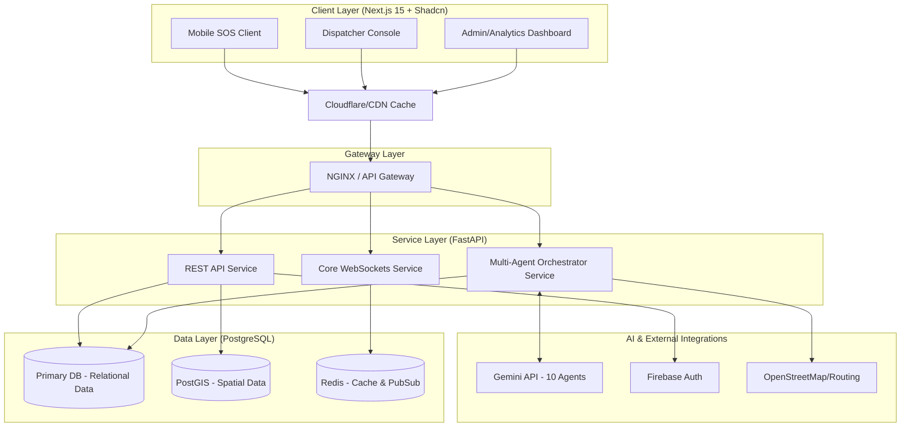

# SYSTEM ARCHITECTURE: ROADGUARDIAN AI

## Executive Architecture Specification

---

## 1. HIGH-LEVEL ARCHITECTURE DIAGRAM



---

## 2. FOLDER STRUCTURE (Monorepo)

```text
roadguardian-platform/
├── frontend/                     # Next.js 15 (React 19) Workspace
│   ├── src/
│   │   ├── app/                  # Next.js App Router (pages/layouts)
│   │   │   ├── (auth)/           # Firebase Auth routes
│   │   │   ├── dashboard/        # Emergency Console View
│   │   │   └── api/              # Internal Next.js API Routes (BFF)
│   │   ├── components/
│   │   │   ├── ui/               # Shadcn UI primitives
│   │   │   └── map/              # OSM/Leaflet interactive maps
│   │   ├── lib/                  # WebSockets hooks, Firebase config
│   │   └── store/                # Zustand / Reactive states
│   └── package.json
│
├── backend/                      # FastAPI Workspace (Python 3.12)
│   ├── app/
│   │   ├── api/
│   │   │   ├── v1/               # REST Endpoints
│   │   │   └── websockets/       # Socket.io / FastAPI WebSocket router
│   │   ├── core/                 # Configs, Security, DB engines
│   │   ├── agents/               # 10 Multi-Agent System logic
│   │   │   ├── coordinator.py
│   │   │   ├── severity_analyzer.py
│   │   │   └── ...
│   │   ├── models/               # SQLAlchemy ORM Models
│   │   └── schemas/              # Pydantic validation schemas
│   ├── requirements.txt
│   └── main.py
│
├── infrastructure/               # Terraform / K8s manifests
└── README.md
```

---

## 3. API DESIGN

### RESTful Endpoints (FastAPI)

- **POST** `/api/v1/incidents/report`
  - _Payload:_ `{ "audio_blob": "...", "lat": "...", "lng": "...", "offline_hash": "..." }`
  - _Response:_ Incident ID, Triaged Severity, Dispatch Status.
- **GET** `/api/v1/incidents/{incident_id}`
  - _Response:_ Detailed telemetry, logs, assigned trauma centers.
- **GET** `/api/v1/hospitals/nearby`
  - _Query:_ `?lat=x&lng=y&radius=10` (Utilizes PostGIS `ST_DWithin`).
  - _Response:_ Level 1/2 trauma centers with active bed counts.

### Realtime WebSockets (`/ws/dispatch`)

- **Event:** `IncidentUpdated`
  - Broadcasts state changes instantly (e.g., `Ambulance Dispatched`).
- **Event:** `AgentLogAppended`
  - Streams the thought-process of the 10-Agent network to the dispatcher console.

---

## 4. SERVICE DESIGN (The Layers)

### Multi-Agent System (AI Layer)

- Driven by **Gemini API**. Agents are wrapped in FastAPI background tasks.
- **Orchestration:** The _Emergency Coordinator Agent_ manages a state machine. It prompts the _Severity Analyzer_, waits for a GCS score response, and then concurrently triggers the _Hospital Discovery_ and _Ambulance Dispatch_ agents.

### Emergency Service Layer

- Interfaces with third-party APIs (e.g., Highway Patrol CAD systems, GVK EMRI).
- Format translations: Converts internal JSON payloads into MoRTH standard XML formats if required.

### Offline Layer

- **Client:** Next.js Service Workers cache the First Aid manuals and UI shell using PWA standards.
- **Telemetry Encoder:** Compresses geolocation and triage data into a Base64-like string (`RG_SOS#C|V2|H1|L13.04,80.15`).
- **Ingress:** A dedicated SMS Gateway (Twilio/Local Telco) receives the offline hash and fires a webhook to the FastAPI backend, bypassing the need for mobile data.

---

## 5. SCALABILITY DESIGN

- **Stateless Scaling:** FastAPI instances run in Kubernetes (K8s) pods behind an Ingress controller. They can independently autoscale based on CPU utilization during mass casualty events or natural disasters.
- **WebSocket Separation:** Realtime sockets are handled by a dedicated auto-scaling pod group backed by a **Redis Pub/Sub** backplane. This prevents long-lived connections from blocking REST traffic.
- **Spatial Indexing:** PostgreSQL is enhanced with **PostGIS**. Spatial indexes (GIST) ensure that querying "nearest ambulance" or "nearest hospital" executes in milliseconds regardless of database size.

---

## 6. SECURITY DESIGN

- **Authentication (Firebase):** Dispatchers and administrators log in via Firebase Auth (MFA enforced). JWT tokens are passed to FastAPI for validation.
- **Role-Based Access Control (RBAC):**
  - _Bystanders:_ Unauthenticated, write-only access strictly rate-limited for SOS reporting.
  - _Dispatchers:_ Read/Write access to specific operational sectors.
- **PII Encryption:** Medical records, passenger identities, and exact casualty locations are encrypted at rest (AES-256) inside PostgreSQL.
- **Rate Limiting / DDoS:** Cloudflare edge caching and FastAPI `slowapi` limit API floods on the reporting endpoints.
