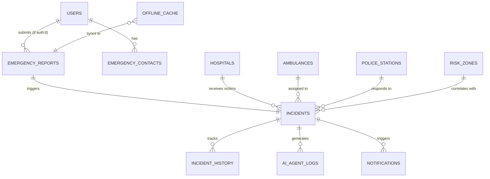

# DATABASE SCHEMA: ROADGUARDIAN AI

## PostgreSQL & PostGIS Implementation

---

## 1. ER DIAGRAM



---

## 2. CORE SQL SCHEMA

```sql
-- Enable PostGIS extension for spatial queries
CREATE EXTENSION IF NOT EXISTS postgis;
-- Enable UUID generation
CREATE EXTENSION IF NOT EXISTS "uuid-ossp";

-- 1. USERS (Dispatchers, Admins, Authenticated Citizens)
CREATE TABLE users (
    id UUID PRIMARY KEY DEFAULT uuid_generate_v4(),
    firebase_uid VARCHAR(128) UNIQUE NOT NULL,
    full_name VARCHAR(100),
    phone_number VARCHAR(20) UNIQUE,
    role VARCHAR(20) DEFAULT 'bystander', -- 'bystander', 'dispatcher', 'admin'
    created_at TIMESTAMP WITH TIME ZONE DEFAULT CURRENT_TIMESTAMP
);

-- 2. EMERGENCY CONTACTS (ICE)
CREATE TABLE emergency_contacts (
    id UUID PRIMARY KEY DEFAULT uuid_generate_v4(),
    user_id UUID REFERENCES users(id) ON DELETE CASCADE,
    contact_name VARCHAR(100) NOT NULL,
    contact_phone VARCHAR(20) NOT NULL,
    relationship VARCHAR(50),
    created_at TIMESTAMP WITH TIME ZONE DEFAULT CURRENT_TIMESTAMP
);

-- 3. HOSPITALS (Trauma Centers)
CREATE TABLE hospitals (
    id UUID PRIMARY KEY DEFAULT uuid_generate_v4(),
    name VARCHAR(150) NOT NULL,
    level VARCHAR(10) NOT NULL, -- e.g., 'Level 1', 'Level 2'
    total_beds INT NOT NULL,
    available_trauma_beds INT NOT NULL,
    location GEOMETRY(Point, 4326) NOT NULL,
    contact_number VARCHAR(20),
    created_at TIMESTAMP WITH TIME ZONE DEFAULT CURRENT_TIMESTAMP
);

-- 4. AMBULANCES
CREATE TABLE ambulances (
    id UUID PRIMARY KEY DEFAULT uuid_generate_v4(),
    plate_number VARCHAR(20) UNIQUE NOT NULL,
    type VARCHAR(20) NOT NULL, -- 'ALS', 'BLS', 'NEONATAL'
    status VARCHAR(20) DEFAULT 'available', -- 'available', 'dispatched', 'en-route', 'maintenance'
    current_location GEOMETRY(Point, 4326) NOT NULL,
    last_ping TIMESTAMP WITH TIME ZONE DEFAULT CURRENT_TIMESTAMP
);

-- 5. POLICE STATIONS
CREATE TABLE police_stations (
    id UUID PRIMARY KEY DEFAULT uuid_generate_v4(),
    station_name VARCHAR(150) NOT NULL,
    jurisdiction_zone VARCHAR(100),
    location GEOMETRY(Point, 4326) NOT NULL,
    contact_number VARCHAR(20)
);

-- 6. RISK ZONES (Black Spots)
CREATE TABLE risk_zones (
    id UUID PRIMARY KEY DEFAULT uuid_generate_v4(),
    highway_name VARCHAR(100) NOT NULL,
    danger_level VARCHAR(20) NOT NULL, -- 'Critical', 'Severe', 'Moderate'
    primary_risk_factor VARCHAR(200),
    recent_accidents INT DEFAULT 0,
    location GEOMETRY(Point, 4326) NOT NULL
);

-- 7. EMERGENCY REPORTS (Raw Ingestion)
CREATE TABLE emergency_reports (
    id UUID PRIMARY KEY DEFAULT uuid_generate_v4(),
    reporter_id UUID REFERENCES users(id) NULL, -- Null if anonymous
    reporter_phone VARCHAR(20) NULL,
    raw_audio_url TEXT NULL,
    transcription TEXT NULL,
    offline_hash VARCHAR(160) NULL, -- High-compression SMS string
    location GEOMETRY(Point, 4326) NOT NULL,
    reported_at TIMESTAMP WITH TIME ZONE DEFAULT CURRENT_TIMESTAMP
);

-- 8. INCIDENTS (Verified Emergency Events)
CREATE TABLE incidents (
    id UUID PRIMARY KEY DEFAULT uuid_generate_v4(),
    report_id UUID REFERENCES emergency_reports(id),
    severity VARCHAR(20) NOT NULL, -- 'Critical', 'Severe', 'Moderate', 'Minor'
    status VARCHAR(20) DEFAULT 'reported', -- 'reported', 'dispatching', 'en-route', 'on-scene', 'resolved'
    description TEXT,
    victim_count INT DEFAULT 1,
    hazmat_flag BOOLEAN DEFAULT FALSE,
    location GEOMETRY(Point, 4326) NOT NULL,
    assigned_hospital_id UUID REFERENCES hospitals(id),
    assigned_ambulance_id UUID REFERENCES ambulances(id),
    resolved_at TIMESTAMP WITH TIME ZONE NULL,
    created_at TIMESTAMP WITH TIME ZONE DEFAULT CURRENT_TIMESTAMP
);

-- 9. INCIDENT HISTORY (State Transitions)
CREATE TABLE incident_history (
    id UUID PRIMARY KEY DEFAULT uuid_generate_v4(),
    incident_id UUID REFERENCES incidents(id) ON DELETE CASCADE,
    previous_status VARCHAR(20),
    new_status VARCHAR(20) NOT NULL,
    changed_by UUID REFERENCES users(id) NULL, -- ID of dispatcher or null if AI
    notes TEXT,
    changed_at TIMESTAMP WITH TIME ZONE DEFAULT CURRENT_TIMESTAMP
);

-- 10. AI AGENT LOGS (Deliberation Telemetry)
CREATE TABLE ai_agent_logs (
    id UUID PRIMARY KEY DEFAULT uuid_generate_v4(),
    incident_id UUID REFERENCES incidents(id) ON DELETE CASCADE,
    agent_name VARCHAR(50) NOT NULL, -- e.g., 'SeverityAnalyzer', 'HospitalDiscoverer'
    action_type VARCHAR(50) NOT NULL,
    processing_time_ms INT,
    log_message TEXT NOT NULL,
    payload JSONB,
    created_at TIMESTAMP WITH TIME ZONE DEFAULT CURRENT_TIMESTAMP
);

-- 11. NOTIFICATIONS
CREATE TABLE notifications (
    id UUID PRIMARY KEY DEFAULT uuid_generate_v4(),
    incident_id UUID REFERENCES incidents(id) ON DELETE CASCADE,
    recipient_type VARCHAR(20) NOT NULL, -- 'contact', 'hospital', 'police'
    recipient_id UUID NULL,
    method VARCHAR(20) NOT NULL, -- 'sms', 'email', 'push'
    status VARCHAR(20) DEFAULT 'pending', -- 'pending', 'sent', 'failed'
    message TEXT NOT NULL,
    created_at TIMESTAMP WITH TIME ZONE DEFAULT CURRENT_TIMESTAMP
);

-- 12. OFFLINE CACHE (Store offline requests before sync)
CREATE TABLE offline_cache (
    id UUID PRIMARY KEY DEFAULT uuid_generate_v4(),
    device_id VARCHAR(100) NOT NULL,
    payload JSONB NOT NULL,
    sync_status VARCHAR(20) DEFAULT 'pending',
    created_at TIMESTAMP WITH TIME ZONE DEFAULT CURRENT_TIMESTAMP
);

-- 13. ANALYTICS (Pre-aggregated Metrics)
CREATE TABLE analytics (
    id UUID PRIMARY KEY DEFAULT uuid_generate_v4(),
    metric_date DATE NOT NULL UNIQUE,
    total_incidents INT DEFAULT 0,
    avg_response_time_seconds INT,
    critical_cases INT DEFAULT 0,
    resolved_cases INT DEFAULT 0,
    updated_at TIMESTAMP WITH TIME ZONE DEFAULT CURRENT_TIMESTAMP
);
```

---

## 3. INDEXES & PERFORMANCE OPTIMIZATIONS

To guarantee sub-millisecond database lookups during the Golden Hour, we apply advanced indexing strategies:

```sql
-- 1. Spatial Indexes (GIST) for ultra-fast radius searches (PostGIS)
CREATE INDEX idx_hospitals_location ON hospitals USING GIST (location);
CREATE INDEX idx_ambulances_location ON ambulances USING GIST (current_location);
CREATE INDEX idx_incidents_location ON incidents USING GIST (location);
CREATE INDEX idx_risk_zones_location ON risk_zones USING GIST (location);

-- 2. B-Tree Indexes on High-Frequency Lookups
CREATE INDEX idx_incidents_status ON incidents(status);
CREATE INDEX idx_ambulances_status ON ambulances(status);
CREATE INDEX idx_users_firebase_uid ON users(firebase_uid);

-- 3. JSONB Indexes for parsing AI Logs quickly
CREATE INDEX idx_ai_agent_logs_payload ON ai_agent_logs USING GIN (payload);

-- 4. Time-series indexing for Analytics & History
CREATE INDEX idx_incident_history_incident_id ON incident_history(incident_id);
CREATE INDEX idx_incidents_created_at ON incidents(created_at DESC);
```

### Advanced Optimizations:

1.  **Table Partitioning:** The `ai_agent_logs` and `incident_history` tables will grow exponentially. They are partitioned by **Month** (`PARTITION BY RANGE (created_at)`).
2.  **Connection Pooling:** PgBouncer is deployed in front of PostgreSQL to handle thousands of concurrent read queries from the WebSocket Publisher (Redis).
3.  **Read Replicas:** Primary DB handles write-heavy transactions (Incident creation). Read Replicas serve the Dispatcher Dashboard analytical views and Heatmap layer rendering.
