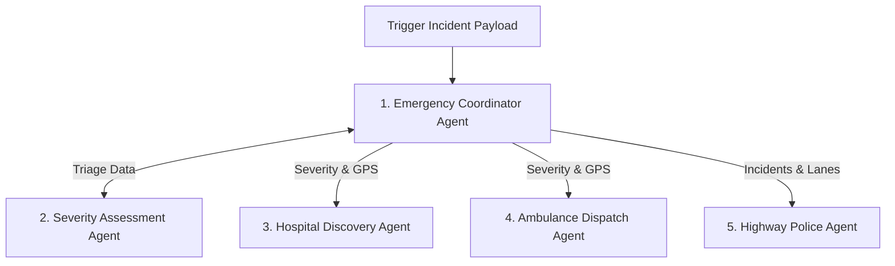

# RoadGuardian AI System Architecture

This document outlines the software and system architecture of the **RoadGuardian AI - Agentic AI Golden Hour Emergency Response Platform**, optimized for national highway incident management.

---

## 1. Executive Setup Architecture

The platform runs a unified high-performance Full-Stack architecture:

```mermaid
graph TD
    %% Frontend Components
    subgraph "Client Layer (React 19 + Tailwind CSS)"
        UI[Dynamic Dashboard UI]
        MapView[Tamil Nadu Map View]
        Kit[Offline Emergency Kit]
        Cons[Multi-Agent Console]
    end

    %% Backend Components
    subgraph "Server Layer (Express v4 + Node + esbuild)"
        Server[Express Server (server.ts)]
        ViteMid[Vite Development Middleware]
        APIRouter[Express API Router]
    end

    %% External Services
    subgraph "External Integration Services"
        Gemini[Google GenAI SDK - model: gemini-2.5-flash]
        OSM[OpenStreetMap Location Engine]
    end

    %% Flows
    UI <--> Server
    UI --> MapView
    Server --> ViteMid
    Server --> APIRouter
    APIRouter <--> Gemini
    APIRouter --> OSM
```

- **Client SPA:** Built using **React 19**, **Vite**, **Tailwind CSS v4**, and **motion** (for stellar micro-interactions and transitions).
- **Backend API Server:** Powered by **Express v4** running on Node.js. It acts as a secure reverse-proxy for API keys (e.g., `GEMINI_API_KEY`) and feeds simulated or real CAD state to the front-end components.
- **Orchestration Hub:** The `AgentSystemViewer` acts as the control operation center, enabling judges to tap into the live decision telemetry of the core 5 agents.

---

## 2. The 5-Agent Interactive Communication Paradigm



1. **Emergency Coordinator Agent (The Orchestrator):** The state machine central. Monitors inputs, executes concurrent dispatches, and logs results.
2. **Severity Assessment Agent (The Clinician):** Evaluates voice feeds, bystander text, or vehicle images to determine a trauma classification.
3. **Hospital Agent (The Bed Finder):** Searches for nearest trauma centers with free beds using spatial lookup proxies.
4. **Ambulance Agent (The Fleet Manager):** Tracks and dispatches closest ALS/BLS paramedic units and sets green corridor coordinates on dashboard HUDs.
5. **Police Agent (The Law Enforcer):** Commands lane blockades and safety perimeters through regional Highway Patrol nodes.

---

## 3. Production Deployment & CI/CD Pipeline

The application compiles into a single bundled Node.js app using `esbuild`. The build bundles client and server components and outputs to `dist/server.cjs` which runs smoothly in container environments such as Google Cloud Run. A standard GitHub actions CI pipeline verifies syntax compiler correctness, builds the solution, and runs regression smoke tests.
